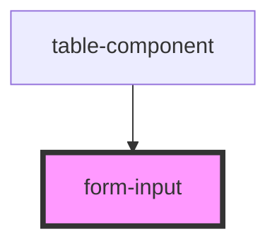

# form-input

<!-- Auto Generated Below -->

## Properties

| Property       | Attribute       | Description | Type      | Default  |
| -------------- | --------------- | ----------- | --------- | -------- |
| `checked`      | `checked`       |             | `boolean` | `false`  |
| `inputHandler` | `input-handler` |             | `any`     | `null`   |
| `name`         | `name`          |             | `string`  | `"name"` |

## Dependencies

### Used by

 - [table-component](../table-component)

### Graph

----------------------------------------------

*Built with [StencilJS](https://stenciljs.com/)*
