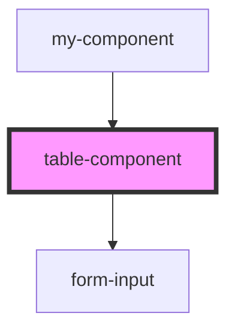

# table-component

<!-- Auto Generated Below -->

## Dependencies

### Used by

 - [my-component](../my-component)

### Depends on

- [form-input](../form-input)

### Graph

----------------------------------------------

*Built with [StencilJS](https://stenciljs.com/)*
